# 实验报告

22302010078 李佳璐

### 一、实验代码
github链接：[git@github.com:lllllljl123/neural_network.git](https://github.com/lllllljl123/neural_network/tree/master/PJ1)
数据集和训练后模型权重链接：https://drive.google.com/drive/folders/1ePTb5UtEJgrQBwGK5LpoxFczlqeY0-G4

### 二、实验结果
1. baseline：简单MLP
   参数：第一层神经网络784个神经元，对应28*28，隐藏层600个神经元，输出层10个神经元，对应10个结果。L2正则化参数为1e-4，batch_size = 32，lr = 0.06。
   结构：三层神经网络，其中包含一层隐藏层。有softmax层，有L2正则化，使用SGD优化。
   训练集及验证集结果：
   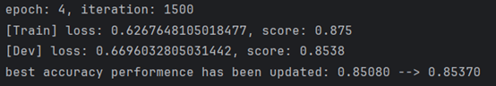
   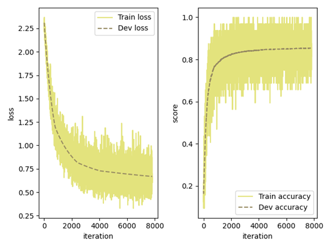
   测试集结果：
   正确率：**86.55%**
   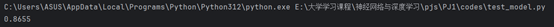
   权重图：
   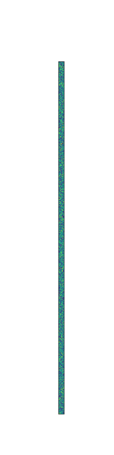
2. 修改网络结构：
   参数：第一层神经网络784个神经元，对应28*28，第一隐藏层256个神经元，第二隐藏层128个神经元，输出层10个神经元，对应10个结果。L2正则化参数为1e-4，batch_size = 32，lr = 0.06。
   结构：四层神经网络，其中包含两层隐藏层。有softmax层，有L2正则化，使用SGD优化。
   训练集及验证集结果：
   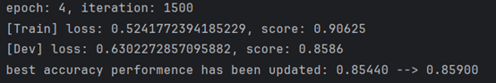
   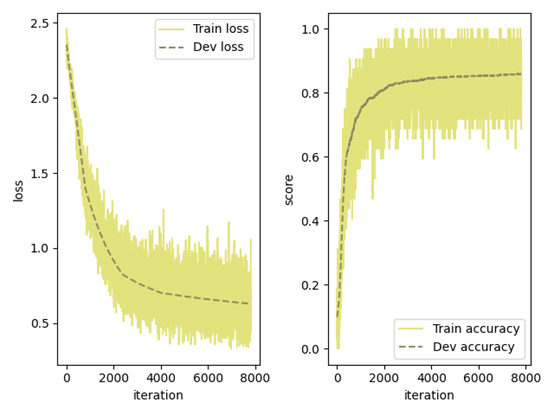
   测试集结果：
   正确率：**87.18%**
   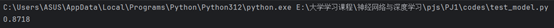
   权重图：
   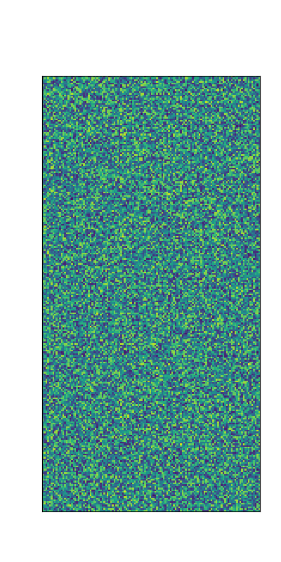
3. 动量优化
   参数：第一层神经网络784个神经元，对应28*28，第一隐藏层256个神经元，第二隐藏层128个神经元，输出层10个神经元，对应10个结果。L2正则化参数为1e-4，batch_size = 32，lr = 0.06,mu = 0.9。
   结构：四层神经网络，其中包含两层隐藏层。有softmax层，有L2正则化，使用动量优化。
   训练集及验证集结果：
   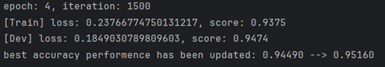
   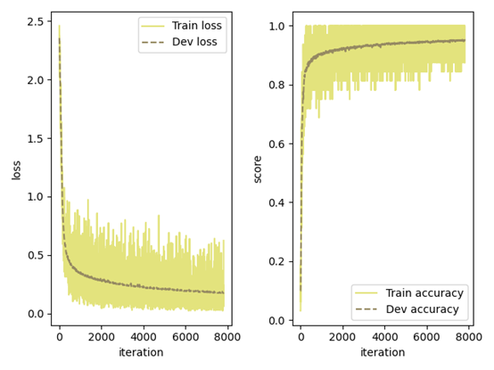
   测试集结果：
   正确率：**95.59%**
   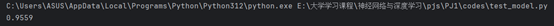
   权重图：
   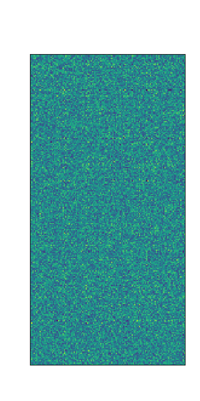
4. L2正则化、dropout等优化
   未考虑早停是因为随着epoch的增加，验证集正确率增加，并未出现过拟合的情况
   - 取消L2正则化：
   参数：第一层神经网络784个神经元，对应28*28，第一隐藏层256个神经元，第二隐藏层128个神经元，输出层10个神经元，对应10个结果。L2正则化参数为0，batch_size = 32，lr = 0.06, mu = 0.9。
   结构：四层神经网络，其中包含两层隐藏层。有softmax层，无L2正则化，使用动量优化。
   训练集及验证集结果：
   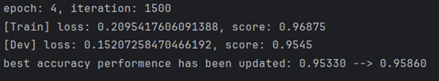
   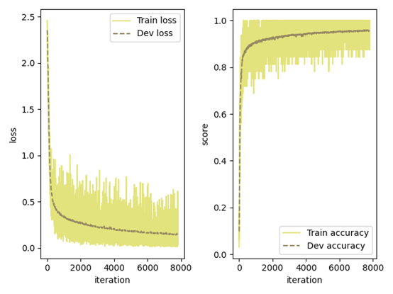
   测试集结果：
   正确率：**96.24%**
   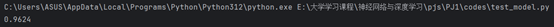
   权重图：
   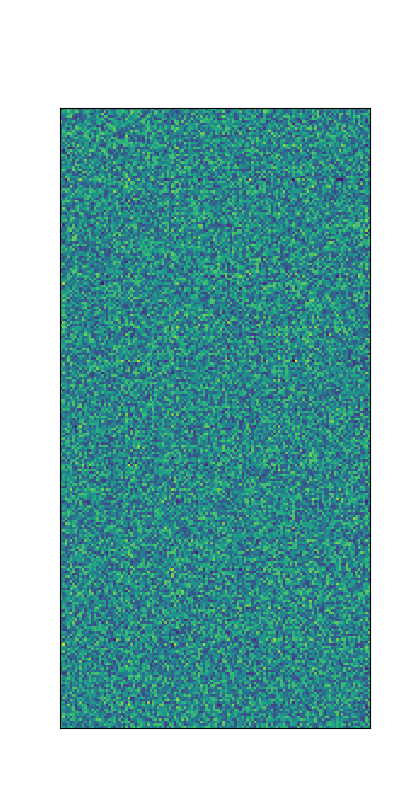
   - dropout
   参数：第一层神经网络784个神经元，对应28*28，第一隐藏层256个神经元，第二隐藏层128个神经元，输出层10个神经元，对应10个结果。L2正则化参数为0，batch_size = 32，lr = 0.06, mu = 0.9, dropout比例为0.5。
   结构：四层神经网络，其中包含两层隐藏层。有softmax层，无L2正则化，使用动量优化。
   训练集及验证集结果：
   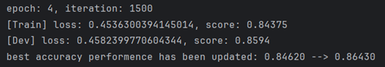
   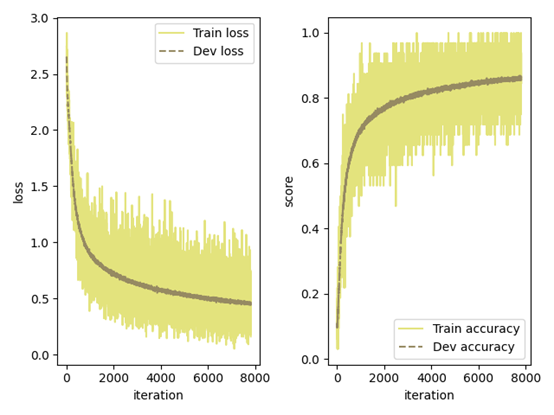
   测试集结果：
   正确率：**94.09%**
   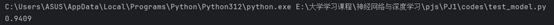
   权重图：
   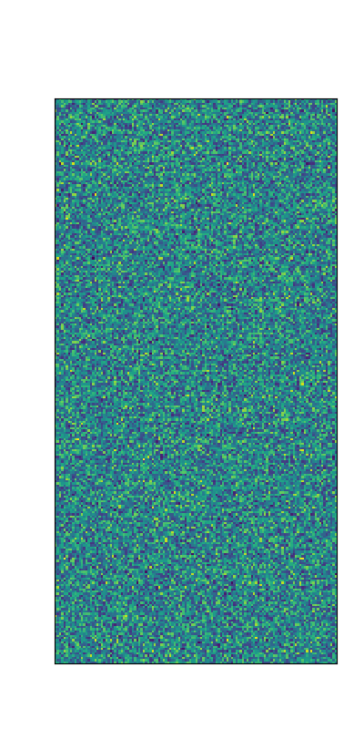
5. softmax层。都有添加
6. 实现：Conv2D。并实现CNN
   结构：
   输入层：1 x 28 x 28（灰度图像）
   第1层：卷积 conv2D:参数：in_channels=1, out_channels=2, kernel_size=5
   输出通道数变为2，输出尺寸为：24×24,输出形状：2 x 24 x 24
   第2层：激活 ReLU.不改变形状。输出形状：2 x 24 x 24
   第3层：池化 MaxPool2x2。将每个 2x2 区域做最大值采样，尺寸减半,输出形状：2 x 12 x 12
   第4层：Flatten。展平成向量：2 x 12 x 12 = 288, 输出形状：(batch_size, 288)
   第5层：全连接 Linear。输入维度：288, 输出维度：32, 输出形状：(batch_size, 32)
   第6层：ReLU。不改变形状, 输出形状：(batch_size, 32)
   第7层：输出层 Linear。输入维度：32,输出维度：10（对应10个数字分类）输出形状：(batch_size, 10)
   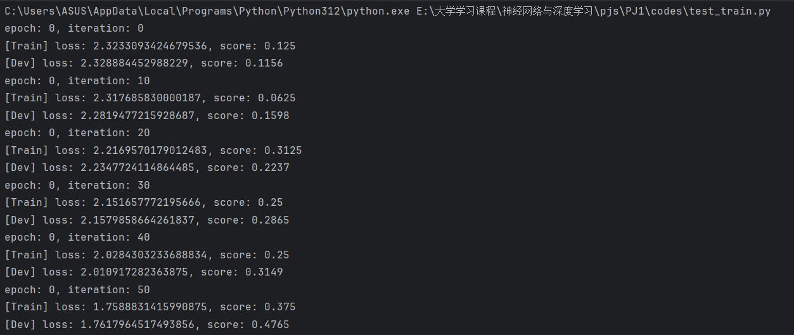
7. 数据增强
   使用随机旋转、随机平移、展平的方式对图像进行增强。收敛速度较4有所下降
   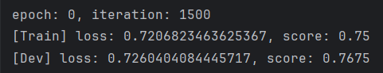

### 三、结果分析
1. 隐藏层为两层时，效果好于只有一层隐藏层。
1. 优化器选择的重要性大于结构微调，Momentum明显优于普通SGD。
2. L2正则化对防止过拟合有效，但当网络容量不大且样本充分时加入正则化可能会使效果更差。
3. Dropout对小网络或小数据集并不一定有效，甚至会适得其反。观察到dropout迁移能力较强，虽然验证集和训练集正确率一般，但是测试集正确率较验证集和训练集提升很多。
4. CNN在只有cpu的numpy上运行速度特别慢

### 四、结论
结构为第一层神经网络784个神经元，第一隐藏层256个神经元，第二隐藏层128个神经元，输出层10个神经元时，不使用L2正则化，batch_size = 32，lr = 0.06, 动量优化mu = 0.9效果最佳。
此时测试集正确率为**96.24%**

  

   
